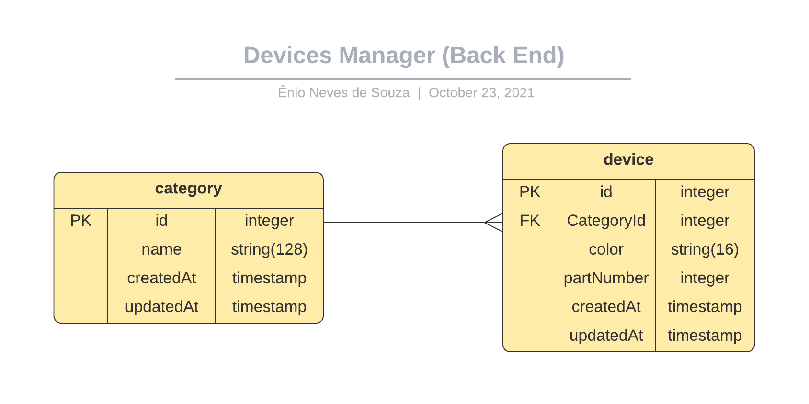

<p align="center">
  <a href="https://github.com/enionsouza/simple-device-manager">
    
  </a>
  <a href="https://github.com/enionsouza/simple-device-manager">
    
  </a>
</p>

# Simple Device Manager (Back End)

## About

This is the back-end (server side) of a simple device management web app. Devices have [id, category, color, partNumber]. The device's categories have [id, name]. An ERD of this schema is presented below:



## Built With

- HTML, CSS, JavaScript;
- NodeJS, ExpressJS;
- MySQL, SequelizeJS;
- VisualStudio Code, Git, & GitHub;

## Pre-requisites

- NodeJS (v. 14.17)
- YarnJS (v. 1.22.10)
- MySQL (v. 8.0.27)
- Git

## Live Demo

Live demo for this project can be found in this [link](https://simple-device-manager-enionsouza.netlify.app).

## Getting Started

### Setting up MySQL

1. To run this app running locally, you'll first need to create a user with all permissions granted. First you'll need to access MySQL Shell with the following command:

```sh
$> mysql -u root -p
```

2. Next, you'll prompted to enter your root password. After you successfully enter your credentials, you'll have access to MySQL Shell.
3. To crate a new user with all permissions granted, in MySQL Shell, run the following command:

```mysql
mysql> CREATE USER 'user_db'@'localhost' IDENTIFIED BY 'eldorado123';
mysql> GRANT ALL PRIVILEGES ON *.* TO 'user_db'@'localhost';
```

That's it! At this point you already have your user created and you can already leave MySQL Shell with the command `\q`

_Alternatively, for security reasons, you can also create a new user to access just a specific database with the following command batch. Nonetheless, for your local environment, the commands previously stated should be preferred, and will be assumed as taken for the rest of these instructions._

```mysql
mysql> CREATE USER 'user_db'@'localhost' IDENTIFIED BY 'eldorado123';
mysql> CREATE DATABASE management_db;
mysql> GRANT ALL PRIVILEGES ON management_db.* TO 'user_db'@'localhost';
```

### Setting up the Server

1. The next step is to set up your server locally. In your terminal, in the folder of your preference, type the following bash command to clone this repository:

```sh
$> git clone git@github.com:enionsouza/simple-device-manager.git
```

2. Now that you have already cloned the repo run the following commands to get the project up and running:

```sh
$> cd simple-device-manager
$> yarn
```

3. Now, to run your migrations and get your database created (if you haven't already) along with the required tables you can either run MySQL scripts provided on [scripts.sql](./scripts) or you can run the [migrations provided with Sequelize.JS ORM](./migrations).

- To run MySQL migrations, simply run the following command on your bash terminal:

```sh
$> mysql < script.sql -u user_db -p
```

- To run SequelizeJS ORM migrations, simply run the following commands:

```sh
$> npx sequelize-cli db:create
$> npx sequelize-cli db:migrate
```

4. Optionally, you can also generate some sample data with the following command:

```sh
$> npx sequelize-cli db:seed:all
```

5. Next, run the following command on your terminal:

```
$> yarn devStart
```

That's it! The project is set up! Now you can access [http://localhost:8080/](http://localhost:8080/). To stop it, hit `<CTRL> + C` on your keyboard.

### End Points

1. Now that your server is up and running, you can use an application like [Postman](https://www.postman.com/) or a terminal command like `curl` to access the previously mentioned URL with the following API end points:

#### /devices

- **GET**: To retrieve all Devices from the database. Example:

```js
fetch('http://localhost:8080/devices')
  .then((res) => res.json())
  .then((data) => {
    console.log(data.filter((device) => device.CategoryId === 5));
  });
```

- **POST**: To create a new Device: `color`, `partNumber`, and an existing `categoryId` must be provided in the request body. Example:

```js
fetch('http://localhost:8080/devices', {
  method: 'POST',
  body: JSON.stringify({
    categoryId: 5,
    color: 'white',
    partNumber: 400,
  }),
  headers: {
    'Content-Type': 'application/json; charset=UTF-8',
    Accept: 'application/json',
  },
})
  .then((res) => res.json())
  .then((data) => console.log(data));
```

- **DELETE**: To delete an existing Device: `id` property must be provided in the request body. Example:

```js
fetch('http://localhost:8080/devices', {
  method: 'DELETE',
  body: JSON.stringify({
    id: 11,
  }),
  headers: {
    'Content-Type': 'application/json; charset=UTF-8',
    Accept: 'application/json',
  },
})
  .then((res) => res.json())
  .then((data) => console.log(data));
```

#### /categories

- **GET**: To retrieve all Categories from the database. Example:

```js
fetch('http://localhost:8080/categories')
  .then((res) => res.json())
  .then((data) => {
    console.log(data);
  });
```

- **POST**: To create a new Category: `name` property must be provided in the request body. Example:

```js
fetch('http://localhost:8080/categories', {
  method: 'POST',
  body: JSON.stringify({
    name: 'New Category',
  }),
  headers: {
    'Content-Type': 'application/json; charset=UTF-8',
    Accept: 'application/json',
  },
})
  .then((res) => res.json())
  .then((data) => console.log(data));
```

- **DELETE**: To delete an existing Category: `id` property must be provided in the request body. Example:

```js
fetch('http://localhost:8080/categories', {
  method: 'DELETE',
  body: JSON.stringify({
    id: 6,
  }),
  headers: {
    'Content-Type': 'application/json; charset=UTF-8',
    Accept: 'application/json',
  },
})
  .then((res) => res.json())
  .then((data) => console.log(data));
```

## Author

👤 **Ênio Neves de Souza**

- GitHub: [@enionsouza](https://github.com/enionsouza)
- Twitter: [@enionsouza](https://twitter.com/enionsouza)
- LinkedIn: [Enio Neves de Souza](https://www.linkedin.com/in/enio-neves-de-souza/)

## 🤝 Contributing

Contributions, issues, and feature requests are welcome!

Feel free to check the [issues page](https://github.com/enionsouza/simple-device-manager/issues).

## Show your support

Give a ⭐️ if you like this project!

## 📝 License

This project is [MIT](./LICENSE) licensed.
